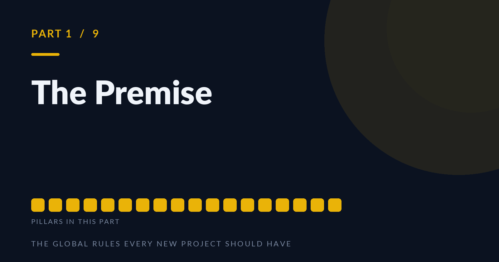
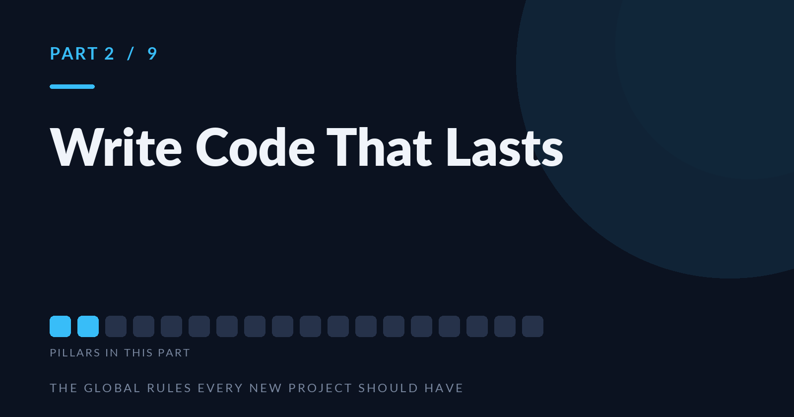
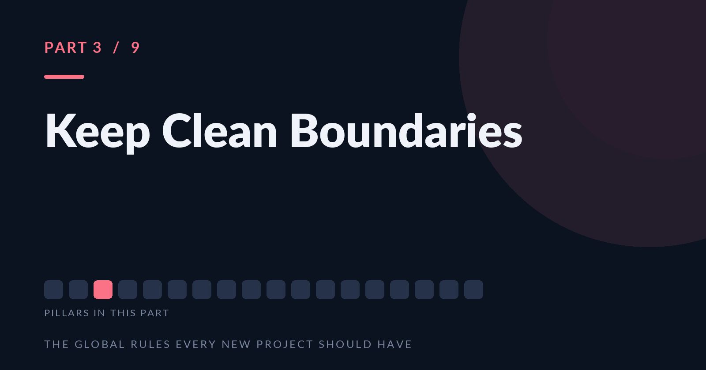
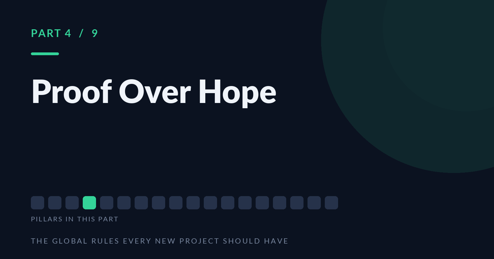
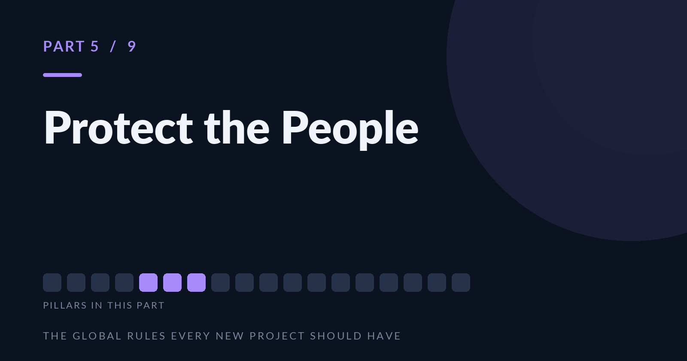
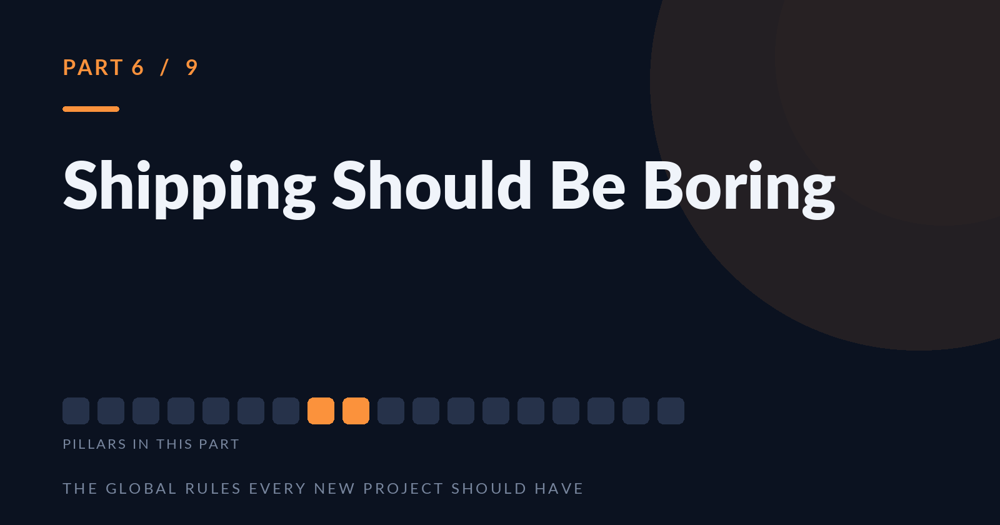
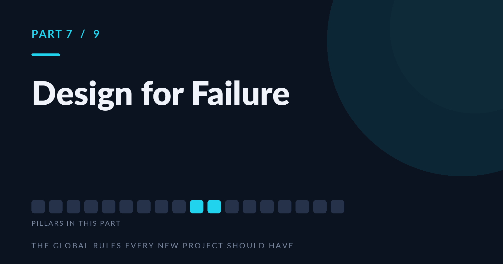
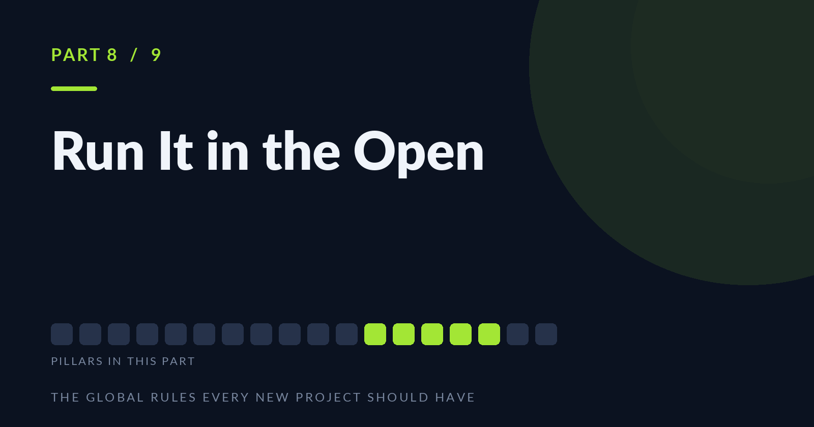
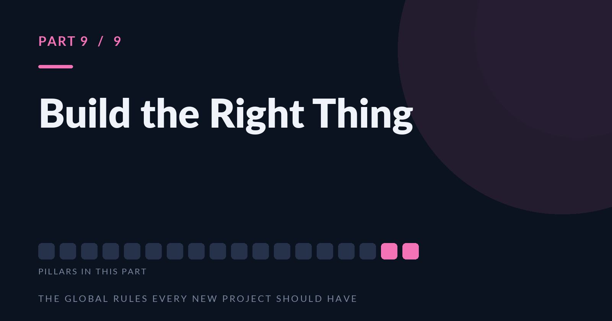

# The Global Rules: Medium Series

Nine publish-ready installments of the manifesto, prose plus code examples (TypeScript/Bun, Java/Quarkus, React), each with a 1600x840 PNG cover in `covers/`.

## How to publish a part

Every article file opens with a **PUBLISH METADATA** block. Copy the Title, Subtitle, and Tags into Medium's matching fields, upload the named cover from `covers/`, then select everything under the **ARTICLE BODY** divider and paste it into the editor. Publish in order.

## Parts

**Part 1. Agree on How You Work Before You Argue About the Stack**  
`01-the-premise.md`  

**Part 2. Write Code That Lasts**  
`02-write-code-that-lasts.md`  

**Part 3. Keep Clean Boundaries**  
`03-clean-boundaries.md`  

**Part 4. Nothing Is Done Until a Machine Says So**  
`04-proof-over-hope.md`  

**Part 5. Secure, Private, Isolated: The Three Defaults That Keep You Off the Front Page**  
`05-protect-the-people.md`  

**Part 6. Boring Is the Highest Compliment You Can Pay a Deployment**  
`06-shipping-should-be-boring.md`  

**Part 7. Everything Breaks. The Only Question Is Whether You Can See It.**  
`07-design-for-failure.md`  

**Part 8. A Rule You Don't Check Is Already Broken**  
`08-run-it-in-the-open.md`  

**Part 9. The Most Expensive Software Is the Kind Nobody Needed**  
`09-build-the-right-thing.md`  

